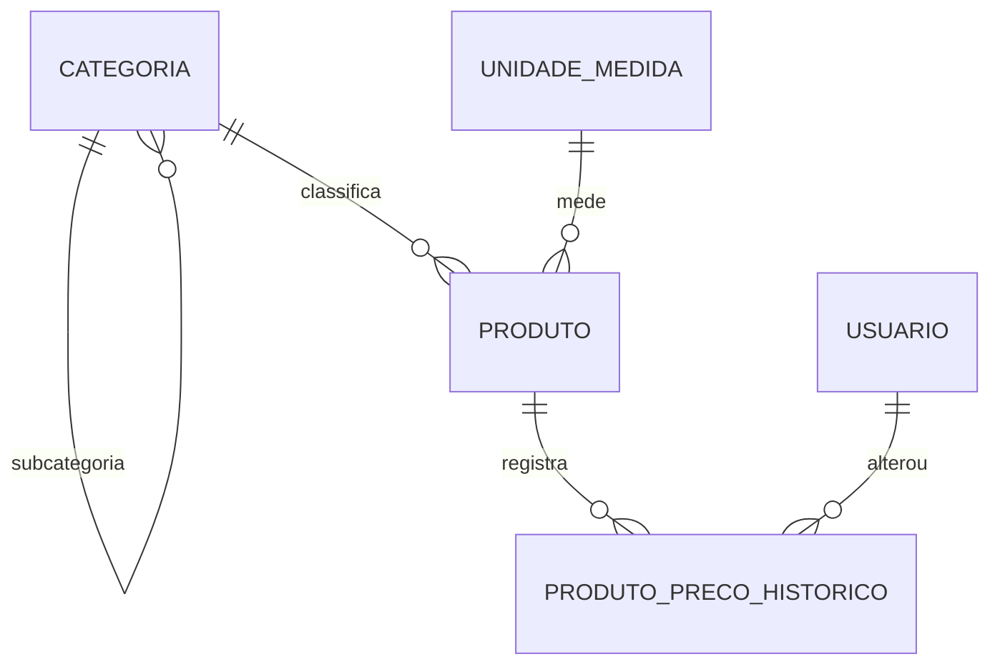

# Prompt de Execução — SIGE / Módulo Produtos

> **Uso:** cole este arquivo inteiro como prompt inicial (ou salve como `.kiro/steering/produtos.md` / `AGENTS.md` na raiz do repositório) para um agente de codificação autônomo — Kiro, Claude Code ou Claude Desktop com acesso ao sistema de arquivos.
> **Origem dos dados:** Documento norteador do Projeto Integrador + Documento de Análise de Requisitos do Grupo Produtos v1.0 + Diagrama de Classes UML do banco.
> **Versão deste prompt:** **2.0** · **Módulo:** Produtos · **Stack:** Node.js 22 + Fastify 5 + PostgreSQL 16 + Vue 3 + Vite

## O que mudou da v1.0 para a v2.0

| Mudança | Consequência |
|---|---|
| **Integração entre módulos foi retirada do escopo** | Contratos CI01–CI07 encerrados; RF23, RF24, RF27 removidos; RF26 alterado; RNF12 e RN10 removidos; RN12 removida; adaptadores, mocks, timeout e resiliência saem do projeto |
| **O sistema passa a ser autônomo** | Nenhuma chamada HTTP a outro módulo. Nada de `ESTOQUE_BASE_URL`, `FORNECEDORES_BASE_URL`, `INTEGRACAO_MODO` |
| **Estoque volta a ser campo do produto** | Como no UML (`estoque numeric(10,3)`), informado no cadastro, sem movimentação. Isso revoga a RN12 |
| **Entram login e cadastro de usuário** | Tabela `usuario` do UML; duas telas novas; RF28–RF32, RNF13, RN13–RN15, UC10 e UC11. Resolve a pendência P-11 dentro do próprio módulo |
| **Complexidade reduzida de propósito** | Sem ORM, sem TypeScript, sem JWT, sem perfis de permissão, sem índice GIN/trigram, sem log estruturado elaborado, sem mock server. Projeto de 4º período de ADS: simples, correto e rastreável |

---

## Sumário

| § | Campo | Conteúdo |
|---|---|---|
| 1 | Papel | Quem o agente é nesta tarefa |
| 2 | Objetivo | Resultado esperado, entregável por entregável |
| 3 | Contexto | Negócio, stack, inventário de requisitos, pendências |
| 4 | Autonomia | O que decide só, o que precisa parar e perguntar |
| 5 | Ferramentas | O que pode usar e com que limite |
| 6 | Restrições | O que não deve ser feito |
| 7 | Critérios de parada | Quando cada fase e o todo estão concluídos |
| 8 | Formato de entrega | Estrutura de pastas, padrões, commits |
| 9 | Verificação | Como confirmar que está correto |
| 10 | Plano de execução | Fases F0 a F9 com tarefas e DoD |
| A–K | Anexos | DDL, Zod, endpoints, telas, autenticação, casos de teste, matriz, massa, checklist |

---

# 1. Papel

Você é um **desenvolvedor full-stack** implementando o **módulo Produtos** do SIGE (Sistema Integrado de Gestão Empresarial), sistema acadêmico de um curso de Análise e Desenvolvimento de Sistemas, com o nicho de negócio de **e-commerce de variedades** (catálogo amplo e heterogêneo, estilo Shopee).

O sistema é **autônomo**: não consome nem provê dados para outros módulos. Ele tem cadastro de produtos, categorias, unidades de medida, histórico de preço e uma autenticação simples de acesso.

Você acumula três competências nesta tarefa:

1. **Back-end e API** — Node.js 22, Fastify 5, SQL explícito com `pg`, OpenAPI 3.
2. **Banco de dados** — PostgreSQL 16, DDL, constraints, índices, queries de verificação.
3. **Front-end e qualidade** — Vue 3 + Vite, plano de testes, casos de teste rastreáveis, Collection do Postman, documentação Markdown e matriz de rastreabilidade.

Dois princípios governam suas decisões:

> **Simplicidade é requisito.** O nível esperado é de um aluno de 4º período: código direto, legível, sem abstração que ninguém do grupo consiga explicar na apresentação. Se a solução simples atende ao requisito, ela é a solução correta.

> **Nada existe fora da rastreabilidade.** Todo endpoint atende a um caso de uso; toda tela cobre um fluxo; todo caso de teste referencia RF, RNF ou RN. Código sem requisito não entra; requisito sem teste é defeito de processo e você sinaliza.

---

# 2. Objetivo

Produzir o **módulo Produtos completo e executável**, com os entregáveis abaixo. Cada linha é verificável.

| # | Entregável | Aceite mínimo |
|---|---|---|
| E1 | **Banco de dados** | DDL versionado para PostgreSQL 16, fiel ao UML com as correções do Anexo A.1; seed de categorias e unidades; script de massa com 5.000 produtos |
| E2 | **API REST** | Endpoints do Anexo D no ar, em `/api/produtos`, `/api/categorias`, `/api/unidades-medida`, `/api/auth`, com corpo de erro padronizado e `situacao` em toda resposta de produto |
| E3 | **Validação** | Schemas Zod únicos, usados no servidor (RNF11) e reaproveitados nos formulários |
| E4 | **Regras de negócio** | RN01 a RN15 ativas implementadas na aplicação e, quando forem de integridade, também no banco |
| E5 | **Autenticação simples** | Cadastro e login por e-mail e senha, com hash da senha (RNF13); guarda de rota no front (RF32). Sem JWT, sem perfis, sem recuperação de senha |
| E6 | **OpenAPI 3** | Especificação servida em `/api/docs` (swagger-ui), cobrindo 100% dos endpoints, com exemplos de erro |
| E7 | **Front-end Vue** | Nove telas do Anexo E, com os quatro estados obrigatórios (carregando, vazio, erro, sucesso) em toda tela que consome API |
| E8 | **Testes automatizados** | Vitest + Supertest: ≥ 1 teste por RF ativo e a bateria negativa do Anexo G; testes de banco com SQL de verificação |
| E9 | **Collection do Postman** | Collection + Environment (`{{base_url}}`), sequência obrigatória do § 9.3 e asserções `pm.test` |
| E10 | **Documentação** | `docs/produtos/01-requisitos.md` … `05-evidencias.md`, diagramas em Mermaid, README executável |
| E11 | **Matriz de rastreabilidade** | Requisito → caso de uso → tela → endpoint → tabela → caso de teste → validador → status |
| E12 | **Relatório de execução** | `docs/produtos/RELATORIO-AGENTE.md`: o que foi feito, o que ficou `[DEFINIR]`, o que reprovou, quem resolve |

**Fora do objetivo:** integração com qualquer outro módulo; vitrine, carrinho, checkout, frete, pagamento; movimentação de estoque; relatório consolidado; perfis e permissões; variações de produto.

---

# 3. Contexto

## 3.1 O que o sistema é

**Cadastro central de produtos.** Existe porque, sem cadastro único, cada área mantém sua própria lista: um lugar registra um preço, outro controla outro item, o relatório soma coisas diferentes.

**Escopo:**
- Cadastro, alteração, consulta e inativação de produtos.
- Códigos de identificação: SKU interno e EAN-13.
- Categorias (com subcategoria) e unidades de medida.
- Preço de custo, preço de venda e histórico de alteração de preço.
- Quantidade em estoque como **campo informativo do produto**, sem movimentação.
- Acesso por login simples com e-mail e senha.

**Limitações declaradas (não implementar):**
1. Não se integra a nenhum outro módulo do SIGE — decisão de escopo da v2.0.
2. Não realiza movimentação de estoque (entrada, saída, reserva). O campo `estoque` é informado manualmente no cadastro ou na edição.
3. Não emite pedido de compra nem de venda.
4. Não aplica desconto, promoção ou regra de precificação comercial.
5. Não gera relatório consolidado.
6. Não trata variações de produto (cor, tamanho, voltagem).
7. Não trata imagens, peso, dimensões, atributos livres por categoria nem marca/fabricante.
8. A autenticação é de acesso, não de autorização: **não há perfis, papéis ou permissões diferenciadas**. Todo usuário autenticado pode tudo.
9. Não há recuperação de senha, confirmação de e-mail, bloqueio por tentativas nem expiração de sessão.

Limitação declarada por escrito vale tanto quanto requisito implementado. O que reprova na avaliação é a lacuna silenciosa — por isso as nove linhas acima vão na seção Limitações de `01-requisitos.md`, cada uma com justificativa.

## 3.2 Consequências do nicho (e-commerce de variedades)

| Característica | Consequência obrigatória |
|---|---|
| Catálogo amplo e heterogêneo | Categoria com subcategoria (`categoria_pai_id`); busca e filtro são funcionalidade central, não acessório |
| Volume alto de itens | Índices em `sku`, `ean13`, `nome`, `categoria_id`, `ativo`. Filtro sem índice não atende ao RNF01 |
| Preço muda com frequência | Histórico de preço é núcleo (RF13, RF14, RN09) |
| Produto sai de linha mas precisa continuar no cadastro | Inativação lógica em vez de exclusão (RF10, RF12, RN05) |
| Poucos operadores cadastrando muito | Formulário rápido, com erro exibido no campo e não em alerta genérico |

## 3.3 Stack — decisões fechadas

Não substituir, não "modernizar", não trocar por preferência pessoal.

| Camada | Tecnologia | Versão | Observação |
|---|---|---|---|
| Linguagem | **JavaScript** (ESM) | ES2023 | **RNF10 impõe JavaScript. Não use TypeScript.** Tipagem via JSDoc, quando ajudar |
| Runtime | Node.js | 22 LTS | `"type": "module"` |
| Framework HTTP | Fastify | 5.x | `@fastify/cors`, `@fastify/helmet`, `@fastify/swagger`, `@fastify/swagger-ui` |
| Validação | Zod | 3.x | Fonte única de verdade das regras de entrada |
| Banco | PostgreSQL | 16 | Docker Desktop + Compose; fallback instalação local |
| Driver | `pg` | 8.x | **SQL explícito e parametrizado. Sem ORM, sem query builder** |
| Hash de senha | `bcryptjs` | 3.x | Duas chamadas: `hash` no cadastro, `compare` no login. Ver RNF13 |
| Front-end | Vue | **3.5.x** | Não existe Vue 19 — corrigir P-12 |
| Build | Vite | 6.x | |
| Rotas | Vue Router | **4.x** | Não existe Vue Router 7 — corrigir P-12 |
| Estado de servidor | `@tanstack/vue-query` | 5.x | Cobre carregando, erro e cache sem reimplementar em cada tela |
| Estado de UI | Pinia | 2.x ou 3.x | Usuário logado e filtros de listagem. Dado de servidor **não** vai para o Pinia |
| Formulários | VeeValidate | **4.x** + `@vee-validate/zod` 4.x | Não existe VeeValidate 7 — corrigir P-12 |
| Estilo | CSS Modules / `<style scoped>` + variáveis CSS | — | Tokens do Figma → variáveis CSS |
| Ícones | `lucide-vue-next` | — | `lucide-react` é pacote React — corrigir P-12 |
| Doc de API | OpenAPI 3 + swagger-ui | — | |
| Testes | Vitest + Supertest | — | Complemento ao Postman, que é obrigatório pelo norteador |
| Doc de projeto | Markdown + Mermaid | — | `docs/produtos/` |

Convenções fixas:

- Prefixo da API: `/api` (recursos no plural, minúsculo, sem acento, sem verbo na URL — `/api/auth/login` é a única exceção, por ser ação e não recurso).
- Corpo de erro único: `{ "erro": "...", "codigo": "...", "detalhes": [] }`.
- Banco: `snake_case`, PK `id`, FK `<tabela>_id`, auditoria `criado_em`/`atualizado_em`, FK nomeada `fk_<tabela>_<referenciada>`, monetário em `NUMERIC` (**nunca `FLOAT`**), tabelas no **singular**.
- Nome de evidência: `CT01-cadastro-produto-aprovado.png`.
- Paginação: padrão 20, máximo 100 (RNF09).

## 3.4 Inventário de requisitos

**Nunca renumere. Nunca reaproveite ID.** Requisito retirado do escopo fica registrado como `REMOVIDO`, com o texto original preservado e a justificativa — nunca some da documentação. Próximos IDs livres após esta versão: **RF35, RNF14, RN16, UC12**.

### 3.4.1 Requisitos funcionais ativos

| ID | Requisito | Prior. | Validador |
|---|---|---|---|
| RF01 | Permitir cadastrar um produto | Alta | Márcio |
| RF02 | Permitir alterar os dados de um produto | Alta | Nathiele |
| RF03 | Permitir consultar um produto pelo identificador | Alta | Ana |
| RF04 | Permitir listar produtos com paginação | Alta | Vinicius |
| RF05 | Permitir filtrar produtos por nome, SKU, categoria e situação | Alta | Márcio |
| RF06 | Impedir o cadastro de produto sem nome | Alta | Nathiele |
| RF07 | Impedir o cadastro de produto sem categoria e sem unidade de medida | Alta | Ana |
| RF08 | Impedir o cadastro de produto com preço de venda ≤ 0 | Alta | Vinicius |
| RF09 | Impedir o cadastro de dois produtos com o mesmo SKU | Alta | Márcio |
| RF10 | Permitir inativar um produto | Alta | Nathiele |
| RF11 | Permitir reativar um produto inativo | Média | Joabe |
| RF12 | Impedir a exclusão física de produto com histórico de preço registrado | Alta | Vítor |
| RF13 | Registrar o histórico de alteração de preço | Média | Ana |
| RF14 | Permitir consultar o histórico de preço de um produto | Média | Vinicius |
| RF15 | Permitir cadastrar uma categoria de produto | Alta | Vítor |
| RF16 | Permitir alterar uma categoria de produto | Média | Joabe |
| RF17 | Permitir listar as categorias cadastradas | Alta | Márcio |
| RF18 | Impedir a inativação de categoria com produto ativo vinculado | Média | Nathiele |
| RF19 | Permitir cadastrar uma unidade de medida | Alta | Ana |
| RF20 | Permitir listar as unidades de medida cadastradas | Alta | Vinicius |
| RF22 | Validar o dígito verificador do EAN-13 quando informado | Baixa | Vítor |
| RF25 | Informar a situação do produto (ativo/inativo) em toda resposta da API | Alta | Guilherme |
| RF26 | **ALTERADO** — Exibir, na tela de detalhe, a quantidade em estoque registrada no produto | Média | Matheus |
| RF28 | **NOVO** — Impedir o cadastro de dois produtos com o mesmo código EAN-13 | Média | Joabe |
| RF29 | **NOVO** — Permitir cadastrar um usuário com nome, e-mail e senha | Alta | Geovana |
| RF30 | **NOVO** — Permitir autenticar um usuário por e-mail e senha | Alta | Gabriel |
| RF31 | **NOVO** — Impedir o cadastro de usuário com e-mail já existente | Alta | Matheus |
| RF32 | **NOVO** — Restringir o acesso às telas de cadastro e consulta a usuário autenticado | Alta | Guilherme |

**Propostas (não ratificadas — marque como `PROPOSTA — ratificar por Ana e Vinicius`):**

| ID | Requisito | Origem |
|---|---|---|
| RF33 | Permitir listar as categorias em estrutura de árvore | P-10; `categoria_pai_id` existe no UML e nenhum RF o usa |
| RF34 | Impedir ciclo na hierarquia de categorias | P-10 |

### 3.4.2 Requisitos funcionais removidos na v2.0

Registrar exatamente assim em `01-requisitos.md`, com o texto original:

| ID | Texto original | Justificativa da remoção |
|---|---|---|
| RF21 | — (nunca existiu) | Lacuna de numeração na v1.0; ID preservado para não renumerar — P-01 |
| RF23 | "O sistema deverá disponibilizar, via API, a consulta de produto por identificador para os demais módulos." | Integração retirada do escopo na v2.0. A consulta por identificador permanece coberta pelo RF03 |
| RF24 | "O sistema deverá disponibilizar, via API, a consulta de múltiplos produtos a partir de uma lista de identificadores." | Sem módulo consumidor, o endpoint em lote não tem caso de uso |
| RF27 | "O sistema deverá exibir mensagem informativa quando o módulo Estoque estiver indisponível, sem impedir a consulta ao produto." | Não há módulo Estoque a consultar; o dado passa a ser campo do próprio produto |

### 3.4.3 Requisitos não funcionais

| ID | Requisito | Métrica | Validador |
|---|---|---|---|
| RNF01 | Listagem de produtos | ≤ 2.000 ms para base de 5.000 registros | Gabriel |
| RNF02 | Consulta por identificador | ≤ 500 ms | Gabriel |
| RNF03 | **ALTERADO** — Restringir a alteração de preço a usuário autenticado | 100% dos endpoints de escrita | Vinicius |
| RNF04 | Registrar data, hora e usuário em toda alteração de preço | 100% das alterações | Ana |
| RNF05 | Interface responsiva | 5 resoluções: 1440×900, 1280×800, 884×1280, 428×926, 320×568 — P-13 | Matheus |
| RNF06 | WCAG 2.1 AA: contraste, teclado, rótulos | contraste ≥ 4.5:1 | Matheus |
| RNF07 | API exclusivamente JSON, UTF-8 | — | Geovana |
| RNF08 | Erros no formato padronizado | 100% das respostas de erro | Geovana |
| RNF09 | Listagem: máximo 100 por requisição, padrão 20 | limite = 100 | Guilherme |
| RNF10 | JavaScript + PostgreSQL | imposição do enunciado | Joabe |
| RNF11 | Validar toda entrada no servidor | 100% dos endpoints | Márcio |
| RNF13 | **NOVO** — Armazenar a senha do usuário de forma não reversível | hash `bcrypt`, custo 10; senha nunca em texto puro no banco nem em log | Vinicius |
| RNF12 | **REMOVIDO** — "Consultas a outros módulos deverão possuir tempo limite de 3 segundos e tratamento de indisponibilidade." | Não há consulta a outro módulo na v2.0 | — |

> **RNF03 alterado:** o texto original exigia "perfil autorizado", o que dependia de um módulo de Usuários que não existia (antiga P-11). Com autenticação própria e sem perfis (limitação 8 do § 3.1), o requisito passa a ser "usuário autenticado". Registre a alteração com o texto anterior preservado.

### 3.4.4 Regras de negócio

| ID | Regra | Onde vive | Validador |
|---|---|---|---|
| RN01 | Preço de venda > 0 | Zod + `CHECK` | Márcio |
| RN02 | Preço de custo ≥ 0 | Zod + `CHECK` | Nathiele |
| RN03 | SKU único e imutável após a criação | `UNIQUE` + bloqueio no serviço de update | Vítor |
| RN04 | EAN-13, quando informado, único e com dígito verificador válido | `UNIQUE` parcial + validador de DV | Vítor |
| RN05 | **ALTERADO** — Produto com histórico de preço não é excluído fisicamente, apenas inativado | serviço + verificação | Joabe |
| RN06 | **ALTERADO** — Produto inativo não aparece na listagem padrão do catálogo | filtro de situação (RF05, RF25) | Ana |
| RN07 | Categoria não é inativada enquanto possuir produto ativo vinculado | serviço + query de verificação | Nathiele |
| RN08 | Nome do produto único dentro da mesma categoria | `UNIQUE (categoria_id, nome)` | Márcio |
| RN09 | Toda alteração de preço gera histórico preservando o valor anterior | transação no serviço | Ana |
| RN11 | Todo produto tem exatamente uma categoria e uma unidade de medida | FK `NOT NULL` | Vinicius |
| RN13 | **NOVA** — O e-mail do usuário é único no sistema | `UNIQUE` + verificação no serviço | Márcio |
| RN14 | **NOVA** — A senha do usuário tem no mínimo 8 caracteres | Zod | Nathiele |
| RN15 | **NOVA** — A senha nunca é retornada em nenhuma resposta da API | `SELECT` sem a coluna nos repositórios de leitura | Ana |
| RN10 | **REMOVIDA** — "A unidade de medida do produto não poderá ser alterada após a existência de movimentação de estoque." | Não há movimentação de estoque na v2.0 | — |
| RN12 | **REMOVIDA** — "A quantidade em estoque não é persistida pelo módulo Produtos; é sempre obtida do módulo Estoque no momento da consulta." | Sem módulo Estoque, a quantidade volta a ser campo do produto, como no UML | — |

> **RN05 e RN06 alterados:** as duas falavam de referência por "outro módulo" e de "novo pedido ou ordem de serviço". Sem integração, a primeira passa a se ancorar no histórico de preço (que é a referência real que existe no banco) e a segunda na visibilidade do catálogo. Texto anterior preservado na documentação.

### 3.4.5 Casos de uso

| UC | Caso de uso | Ator | RFs |
|---|---|---|---|
| UC01 | Cadastrar produto | Operador de cadastro | RF01, RF06, RF07, RF08, RF09, RF22, RF28 |
| UC02 | Alterar produto | Operador de cadastro | RF02, RF13 |
| UC03 | Consultar e listar produtos | Operador, Gestor | RF03, RF04, RF05, RF26 |
| UC04 | Inativar e reativar produto | Gestor comercial | RF10, RF11, RF12 |
| UC05 | Gerenciar categorias | Operador de cadastro | RF15, RF16, RF17, RF18 |
| UC06 | Gerenciar unidades de medida | Operador de cadastro | RF19, RF20 |
| UC08 | Consultar histórico de preço | Gestor comercial | RF14 |
| UC10 | **NOVO** — Cadastrar usuário | Visitante | RF29, RF31 |
| UC11 | **NOVO** — Autenticar-se no sistema | Visitante | RF30, RF32 |
| UC07 | **REMOVIDO** | — | Lacuna de numeração na v1.0 — P-01 |
| UC09 | **REMOVIDO** — "Consultar produto por outro módulo" | — | Integração retirada do escopo na v2.0 |

### 3.4.6 Integrações

**Nenhuma.** Os contratos CI01 a CI07 são **encerrados** na v2.0. Registre-os em `01-requisitos.md` como:

> `CI01 a CI07 — ENCERRADOS na v2.0. Integração entre módulos retirada do escopo. Os IDs não são reaproveitados.`

Nada de pasta `contratos/`, nada de adaptador, nada de mock, nada de timeout.

### 3.4.7 Critérios de aceitação

Já escritos na v1.0 e mantidos (não reescreva): **RF01, RF06, RF08, RF09, RF10, RF12, RF13**.
Precisam ser escritos por você, no formato `Dado que … quando … então …`, marcados como `PROPOSTA — ratificar por Ana e Vinicius`: **RF02, RF03, RF04, RF05, RF07, RF11, RF14, RF15, RF16, RF17, RF18, RF19, RF20, RF22, RF25, RF26, RF28, RF29, RF30, RF31, RF32** (P-02).
Os critérios de RF23, RF24 e RF27 saem junto com os requisitos, preservados na seção de removidos.

## 3.5 Pendências

| ID | Pendência | Situação na v2.0 |
|---|---|---|
| P-01 | RF21 e UC07 não existem | **Aberta (documentação):** registrar como `REMOVIDO` com justificativa de lacuna de numeração. Não criar item novo para tapar o buraco |
| P-02 | RF sem critério de aceitação | **Aberta:** escreva os faltantes como `PROPOSTA` (§ 3.4.7) |
| P-03 | DER traz `estoque` na tabela `produto` | **ENCERRADA:** com a RN12 removida, o campo é legítimo e volta ao modelo como no UML |
| P-04 | DER tem um único campo `preco` | **RESOLVIDA NO CÓDIGO:** `preco_custo` e `preco_venda`, porque RN01, RN02 e RN09 exigem os dois. É a única divergência mantida em relação ao UML — justifique na documentação técnica |
| P-05 | Falta campo e unicidade de EAN-13 | **RESOLVIDA NO CÓDIGO:** `ean13 CHAR(13)` + `UNIQUE` parcial + RF28 |
| P-06 | Vínculo com fornecedor | **ENCERRADA:** sem módulo Fornecedores, o vínculo sai do escopo. Não criar `produto_fornecedor` |
| P-07 | `DELETE` sem RF que o autorize | **RESOLVIDA:** RF12 alterado. O `DELETE` existe, verifica histórico e, com `PERMITIR_EXCLUSAO_FISICA=false` (default), responde `409 EXCLUSAO_NAO_PERMITIDA` orientando a inativação |
| P-08 | RN04 exige EAN único, sem RF | **RESOLVIDA:** RF28 criado |
| P-09 | Falta `UNIQUE (categoria_id, nome)` | **RESOLVIDA NO CÓDIGO** |
| P-10 | `categoria_pai_id` sem RF que o use | **Aberta:** implemente a hierarquia em leitura e proponha RF33 e RF34 |
| P-11 | Autenticação sem módulo dono | **ENCERRADA:** autenticação passa a ser do próprio módulo (RF29–RF32, RNF13, RN13–RN15) |
| P-12 | Versões inexistentes no documento de tecnologias | **RESOLVIDA:** use as versões do § 3.3 e registre a correção |
| P-13 | RNF05 com métrica de 3 breakpoints e 5 resoluções | **RESOLVIDA:** implemente as 5 e corrija a métrica do documento |
| P-14 | `CI01` usado com dois sentidos | **ENCERRADA:** contratos encerrados |
| P-15 | RF com a equipe inteira como responsável | **Aberta:** use a coluna Validador de § 3.4 em toda matriz e em todo caso de teste, como `PROPOSTA — ratificar em reunião` |
| P-16 | Contratos não confirmados | **ENCERRADA:** contratos encerrados |
| P-17 | Escopo de variações de produto | **ENCERRADA:** fora de escopo, declarado na Limitação 6 |
| **P-18** | **NOVA** — A autenticação não tem perfis, expiração de sessão nem validação de sessão no servidor (o front envia o `id` do usuário em `x-usuario-id`). Isso é suficiente para o escopo acadêmico, mas **não** é controle de acesso real | **Aberta (decisão registrada):** declarada na Limitação 8 e 9. Levar ao professor se a disciplina exigir controle de acesso efetivo |
| **P-19** | **NOVA** — O UML define `usuario.senha varchar(50)`, tamanho insuficiente para um hash bcrypt (60 caracteres) | **RESOLVIDA NO CÓDIGO:** `senha VARCHAR(60)`. Única alteração no UML da tabela `usuario`; justifique pelo RNF13 |

---

# 4. Autonomia

## 4.1 Decida sozinho

- Organização interna de pastas, nomes de arquivo, granularidade de funções.
- Assinatura de funções, estrutura de serviços e repositórios, tratamento de erro interno.
- Nomes de índice e de constraint (respeitando `fk_<tabela>_<referenciada>`), ordem das migrations.
- Composição de componentes Vue, props, estrutura das stores Pinia.
- Textos de UI, mensagens de erro, labels, placeholders — em português do Brasil.
- Organização das suítes de teste, fixtures e factories.
- Comandos Git, mensagens em Conventional Commits, `.gitignore`, README.
- Critérios de aceitação faltantes (P-02) e ajustes na distribuição de validadores.

## 4.2 Implemente o default indicado e registre no relatório

- `estoque` como campo informativo do produto, sem movimentação (§ 3.1, Limitação 2).
- `senha VARCHAR(60)` com bcrypt custo 10 (P-19, RNF13).
- `DELETE` respondendo `409` por default (P-07).
- Hierarquia de categorias apenas em leitura, com RF33/RF34 como proposta (P-10).
- Preços separados, divergindo do UML (P-04).
- Qualquer campo que **nenhum requisito justifique**: não crie. Se julgar indispensável, registre como proposta de requisito no relatório.

## 4.3 Pare e pergunte

Escreva em `docs/produtos/PERGUNTAS-ABERTAS.md`, siga com o trabalho que não depende da resposta e destaque no relatório final:

1. Qualquer necessidade de **perfil, papel ou permissão diferenciada** — não existe na v2.0 (P-18).
2. Mudança em **decisão fechada** do § 3.3 (trocar Fastify, usar ORM, usar TypeScript, usar Tailwind).
3. Alteração de **texto ou numeração** de requisito além das já registradas em § 3.4.
4. Reintrodução de **qualquer integração** com outro módulo.
5. Datas, prazos e cronograma — não existem neste prompt e você não os inventa.
6. **Resultado de teste**: `Resultado obtido` é preenchido por quem executou. Entregue `[PREENCHER APÓS EXECUÇÃO]`.

---

# 5. Ferramentas

| Ferramenta | Uso permitido | Limite |
|---|---|---|
| **Sistema de arquivos** | Criar e editar em `backend/`, `frontend/`, `shared/`, `database/`, `tests/`, `docs/produtos/`, raiz | Nunca edite arquivos ou pastas de outras equipes |
| **Terminal** | `npm install`, `npm run`, `node`, `npx vitest`, `docker compose`, `psql`, `git` local | Sem `git push`, sem abrir PR, sem commit na `main` |
| **Docker + Compose** | Subir PostgreSQL 16 local | Sem publicar imagem, sem serviço pago |
| **PostgreSQL / psql** | DDL, seed, queries de verificação | Sem `DROP DATABASE` fora de `db:reset`; migration sempre idempotente |
| **Postman / Newman** | Gerar Collection e Environment; rodar via Newman | Não invente resultado de execução |
| **Git** | Branch `equipe-produtos` e derivadas `feat/`, `fix/`, `docs/`, `test/` | `main` intocável; PR é papel do Joabe |
| **Rede** | Apenas registries de pacote | **Nenhuma chamada HTTP a outro sistema em runtime.** O sistema é autônomo |
| **Geração de massa** | `database/seed/massa-5000.js`, dados sintéticos e identificáveis | Massa sintética não se passa por dado de teste manual |

---

# 6. Restrições

## 6.1 Proibições absolutas

1. **Não use ORM nem query builder.** SQL explícito e parametrizado com `pg`. Sem Prisma, Sequelize, TypeORM, Knex, Drizzle.
2. **Não use TypeScript.** RNF10 impõe JavaScript.
3. **Não implemente integração com outro módulo.** Sem cliente HTTP externo, sem adaptador, sem mock de módulo, sem timeout de dependência, sem `*_BASE_URL`.
4. **Não implemente JWT, refresh token, sessão no servidor, perfis, papéis, permissões, recuperação de senha, confirmação de e-mail ou bloqueio por tentativas.** Login e cadastro simples, como descrito no Anexo F.
5. **Não armazene senha em texto puro** e não a retorne em nenhuma resposta ou log (RNF13, RN15).
6. **Não apague produto fisicamente** por default (RF12, RN05).
7. **Não use `FLOAT`, `REAL` ou `DOUBLE PRECISION`** para valor monetário. `NUMERIC(10,2)`.
8. **Não renumere, não reaproveite e não apague da documentação** requisito, caso de uso ou contrato. Removido fica registrado como removido.
9. **Não invente** resultado de teste, evidência, print ou status HTTP obtido.
10. **Não declare requisito homologado.** Homologação é ato do Vinicius, com evidência.
11. **Não implemente** carrinho, checkout, frete, pagamento, desconto, promoção, movimentação de estoque, relatório consolidado, variação de produto, imagem de produto, importação em massa.
12. **Não commite** `node_modules`, `.env`, dump de banco ou binário. `.env.example` é versionado.
13. **Não toque na `main`** e não abra Pull Request.

## 6.2 Restrições de complexidade — nível 4º período de ADS

O projeto é avaliado por processo e rastreabilidade, não por sofisticação. Portanto:

- **Três camadas, no máximo:** rota (HTTP e schema) → serviço (regra de negócio) → repositório (SQL). Sem repository pattern genérico, sem injeção de dependência, sem CQRS, sem event bus, sem decorator próprio.
- **Sem abstração preventiva.** Não crie classe base, factory ou helper para um único uso.
- **Busca por nome com `ILIKE`** e índice comum. Sem extensão de banco, sem `pg_trgm`, sem índice GIN, sem full-text search.
- **Log:** o logger padrão do Fastify. Sem log estruturado elaborado, sem correlação de requisição.
- **Sem cache de servidor, sem fila, sem worker, sem WebSocket, sem Docker do app** (só do banco).
- **Sem monorepo tooling** (workspaces, Turborepo, Nx). Dois `package.json` simples, `backend/` e `frontend/`, mais a pasta `shared/` importada por caminho relativo e por alias do Vite.
- **Testes diretos:** `describe`/`it` com Supertest. Sem mock elaborado, sem container de teste — um banco de teste separado basta.
- Todo arquivo que você escrever deve ser explicável em voz alta por um integrante do grupo na apresentação. Se não for, simplifique.

## 6.3 Restrições de qualidade

- **Nada fora da rastreabilidade.** Endpoint sem caso de uso, tela sem fluxo, caso de teste sem requisito: remova ou registre como proposta.
- **Regra de integridade vive no banco também.** Regra que só existe na aplicação não sobrevive a acesso direto ao banco — e os testes de banco vão pegar isso.
- **Validação no servidor é obrigatória mesmo com validação no formulário** (RNF11).
- **Nenhuma tela sem os quatro estados:** carregando, vazio, erro, sucesso.
- **Nenhuma decisão de interface sem justificativa** ancorada em princípio real (lei de Fitts, lei de Hick, proximidade de Gestalt, hierarquia visual, WCAG) — não em opinião estética.
- **Lacuna vira `[DEFINIR: …]` visível**, nunca invenção plausível.

---

# 7. Critérios de parada

## 7.1 Por fase

Cada fase de § 10 tem um *Definition of Done*. A fase só encerra quando todos os itens passam e o comando de verificação do § 9 roda sem erro. Se um item depender de pendência aberta, registre em `PERGUNTAS-ABERTAS.md` e siga para o que não depende dela.

## 7.2 Parada global — a tarefa está concluída quando

- [ ] `docker compose up -d` sobe o PostgreSQL 16 e `npm run db:migrate && npm run db:seed` roda do zero sem erro.
- [ ] `npm run dev` (backend) sobe; `GET /api/health` responde `200`.
- [ ] `npm run dev` (frontend) sobe e as nove telas navegam sem erro de console.
- [ ] Cadastro de usuário e login funcionam; sem login, as telas de produto redirecionam para `/login` (RF32).
- [ ] Todos os endpoints do Anexo D respondem conforme especificado, inclusive os códigos de erro.
- [ ] `npm test` passa, com ≥ 1 teste por RF ativo e toda a bateria negativa do Anexo G.
- [ ] `/api/docs` serve a especificação OpenAPI 3 com 100% dos endpoints.
- [ ] `npm run db:verificar` roda e cada query retorna o resultado esperado documentado ao lado.
- [ ] Collection e Environment do Postman existem, com a sequência obrigatória e asserções `pm.test`.
- [ ] Os cinco documentos de `docs/produtos/` existem, sem seção vazia sem `[DEFINIR]`.
- [ ] `matriz-rastreabilidade.md` cobre todos os RF, RNF e RN **ativos**, com coluna Validador, e lista os removidos em seção própria.
- [ ] `RELATORIO-AGENTE.md` lista o que ficou pendente, quem resolve e por quê.
- [ ] `git status` limpo na branch `equipe-produtos`, commits em Conventional Commits, nada na `main`.

## 7.3 Não é critério de parada

"O CRUD funciona", "compila sem erro", "o layout está bonito", "os testes que eu escrevi passam". O módulo está pronto quando é **rastreável e homologável** — e a homologação é ato humano, com evidência.

---

# 8. Formato de entrega

## 8.1 Estrutura do repositório

Respeite a estrutura imposta pelo norteador (repositório único da turma). Não crie pasta nova na raiz.

```
/
├── backend/
│   ├── src/
│   │   ├── server.js                 # bootstrap Fastify: cors, helmet, swagger, rotas, error handler
│   │   ├── config/
│   │   │   ├── env.js                # variáveis validadas com Zod
│   │   │   └── db.js                 # Pool do pg + helper de transação
│   │   ├── rotas/
│   │   │   ├── auth.rotas.js         # RF29, RF30
│   │   │   ├── produtos.rotas.js
│   │   │   ├── categorias.rotas.js
│   │   │   ├── unidades-medida.rotas.js
│   │   │   └── health.rotas.js
│   │   ├── servicos/                 # regras de negócio
│   │   │   ├── auth.servico.js       # bcrypt hash/compare (RNF13)
│   │   │   ├── produtos.servico.js
│   │   │   ├── precos.servico.js     # RN09 — histórico em transação
│   │   │   ├── categorias.servico.js
│   │   │   └── unidades.servico.js
│   │   ├── repositorios/             # SQL explícito e parametrizado
│   │   │   ├── usuarios.repo.js      # nenhum SELECT retorna a coluna senha (RN15)
│   │   │   ├── produtos.repo.js
│   │   │   ├── categorias.repo.js
│   │   │   ├── unidades.repo.js
│   │   │   └── historico.repo.js
│   │   ├── erros/
│   │   │   ├── erro-aplicacao.js     # classe com codigo + status
│   │   │   ├── codigos.js            # catálogo único (Anexo C)
│   │   │   └── handler.js            # Zod → 422 no corpo padrão
│   │   └── util/
│   │       ├── ean13.js              # dígito verificador (RF22, RN04)
│   │       └── paginacao.js          # padrão 20, máximo 100 (RNF09)
│   ├── openapi/openapi.json          # gerado
│   ├── .env.example
│   └── package.json
│
├── frontend/
│   ├── src/
│   │   ├── main.js                   # Vue, Router, Pinia, VueQuery
│   │   ├── App.vue
│   │   ├── rotas/index.js            # inclui a guarda de rota do RF32
│   │   ├── paginas/                  # uma por tela do Anexo E
│   │   ├── componentes/
│   │   │   ├── base/                 # Botao, Campo, Select, Tabela, Modal, Badge, Paginacao
│   │   │   └── estado/               # Carregando, Vazio, Erro
│   │   ├── api/                      # um arquivo por recurso
│   │   ├── stores/
│   │   │   ├── sessao.js             # usuário logado (Pinia + localStorage)
│   │   │   └── filtros.js
│   │   ├── composables/
│   │   └── estilos/
│   │       ├── tokens.css            # variáveis CSS (tokens do Figma)
│   │       └── base.css
│   ├── .env.example
│   └── package.json
│
├── shared/
│   └── schemas/                      # Zod: usados no back e nos formulários
│       ├── usuario.schema.js
│       ├── produto.schema.js
│       ├── categoria.schema.js
│       ├── unidade-medida.schema.js
│       └── paginacao.schema.js
│
├── database/
│   ├── migrations/
│   │   ├── 001_usuario.sql
│   │   ├── 002_categoria.sql
│   │   ├── 003_unidade_medida.sql
│   │   ├── 004_produto.sql
│   │   ├── 005_produto_preco_historico.sql
│   │   └── 006_indices.sql
│   ├── seed/
│   │   ├── 001_unidades_medida.sql
│   │   ├── 002_categorias.sql
│   │   ├── 003_usuario_inicial.sql   # usuário de demonstração, senha já com hash
│   │   └── massa-5000.js             # RNF01
│   ├── verificacao/                  # testes de banco em SQL
│   │   ├── unicidade-sku.sql
│   │   ├── unicidade-ean13.sql
│   │   ├── unicidade-nome-categoria.sql
│   │   ├── unicidade-email.sql
│   │   ├── fk-categoria-orfao.sql
│   │   ├── historico-preco.sql
│   │   ├── senha-nao-textual.sql
│   │   └── tipos-monetarios.sql
│   └── docker-compose.yml
│
├── tests/
│   ├── api/                          # Supertest por endpoint
│   ├── regras/                       # RN ativas
│   ├── negativos/                    # bateria do Anexo G
│   ├── auth/                         # RF29–RF32, RNF13, RN13–RN15
│   └── helpers/
│
├── postman/
│   ├── SIGE-Produtos.postman_collection.json
│   └── SIGE-Produtos.postman_environment.json
│
├── docs/produtos/
│   ├── 01-requisitos.md
│   ├── 02-uxui.md
│   ├── 03-tecnica.md
│   ├── 04-plano-de-testes.md
│   ├── 05-evidencias.md
│   ├── matriz-rastreabilidade.md
│   ├── diagramas/
│   ├── evidencias/                   # CT<id>-<descricao>-<situacao>.png
│   ├── PERGUNTAS-ABERTAS.md
│   └── RELATORIO-AGENTE.md
│
└── README.md
```

## 8.2 Padrões de código

- ESM (`import`/`export`), `"type": "module"`, sem CommonJS.
- Arquivos em `kebab-case`; identificadores em `camelCase`; componentes Vue em `PascalCase`.
- Camadas: rota → serviço → repositório. Rota não acessa banco; repositório não conhece HTTP.
- Todo SQL parametrizado com `$1, $2`. **Nenhuma interpolação de string em query.**
- Operação com mais de um `INSERT`/`UPDATE` roda em transação (cadastro de produto + histórico inicial; alteração de preço + histórico).
- Erro de domínio é lançado como `ErroAplicacao` com `codigo` e `status`; o handler global traduz para o corpo padrão. Nenhuma rota monta corpo de erro na mão.
- Nenhum `console.log` em código de produção — use `request.log` do Fastify.
- Componentes Vue com `<script setup>`. Dado de servidor via TanStack Query; **nunca** copie resposta de API para o Pinia (exceção: o usuário logado, que é estado de sessão).
- `shared/` é importado por caminho relativo no backend e por alias `@shared` configurado no `vite.config.js`.

## 8.3 Documentação

- Todo documento abre com módulo, versão, data, autores, status.
- Diagramas em Mermaid dentro do Markdown.
- Toda decisão de interface acompanhada da justificativa (§ 6.3).
- Evidência em `docs/produtos/evidencias/`, nome `CT<id>-<descricao>-<aprovado|reprovado>.png`. Você cria a pasta e a lista esperada, **não** os arquivos.
- `[DEFINIR: …]` sempre que a decisão for do grupo.
- Ao fim de cada documento longo, 3 a 5 linhas de pendências com responsável.
- **Seção obrigatória de histórico de versões** em `01-requisitos.md`, registrando a passagem da v1.0 para a v2.0: itens removidos, alterados e criados, cada um com justificativa. É isso que mostra ao professor que a mudança de escopo foi gerida, não improvisada.

## 8.4 Git

```bash
git switch -c equipe-produtos            # se ainda não existir
git switch -c feat/produtos-banco        # uma branch por frente
```

Conventional Commits, escopo sempre `produtos`:

```
feat(produtos): cria tabela usuario e cadastro simples (RF29)
feat(produtos): adiciona login por email e senha com bcrypt (RF30, RNF13)
fix(produtos): remove adaptadores de integracao do escopo v2.0
docs(produtos): registra remocao de RF23, RF24, RF27 e CI01-CI07
test(produtos): adiciona bateria negativa de RF06 a RF12
```

Um commit por unidade lógica. Não acumule a fase inteira em um commit. Nunca commite na `main`.

---

# 9. Verificação

## 9.1 Comandos (devem existir e passar)

```bash
# Banco
docker compose -f database/docker-compose.yml up -d
npm run db:migrate          # idempotente: rodar duas vezes não quebra
npm run db:seed
npm run db:massa            # 5.000 produtos para o RNF01
npm run db:verificar        # roda database/verificacao/*.sql e imprime o resultado

# Backend
npm run dev
npm run openapi             # gera backend/openapi/openapi.json
npm test
npm run test:cobertura

# Frontend
npm run dev
npm run build

# API por fora
npx newman run postman/SIGE-Produtos.postman_collection.json \
  -e postman/SIGE-Produtos.postman_environment.json
```

## 9.2 Gate por camada

| Camada | Como confirmar | Evidência |
|---|---|---|
| Banco | `npm run db:verificar`: cada query retorna o resultado documentado ao lado | saída do psql |
| Regra de negócio | Teste por RN ativa; para as de integridade, **também** tentativa de violação direta no banco | relatório do Vitest |
| API | Supertest por endpoint, cobrindo sucesso e todos os códigos de erro previstos | relatório do Vitest |
| Autenticação | Cadastro grava hash (nunca a senha); login aceita a senha correta e recusa a errada com a **mesma** mensagem genérica; nenhuma resposta contém a senha | teste dedicado + `senha-nao-textual.sql` |
| Contrato de erro | Todo erro conferido contra `{ erro, codigo, detalhes }`; nenhum vazamento de stack | teste dedicado |
| OpenAPI | Nenhuma rota registrada no Fastify ausente do JSON gerado | `npm run openapi:conferir` |
| Front-end | Cada tela renderiza os quatro estados; erro e vazio checados com resposta simulada | build + checklist |
| RF32 | Sem sessão, `/produtos` redireciona para `/login`; com sessão, navega | teste manual registrado |
| RNF01 / RNF02 | Medição com massa de 5.000: listagem ≤ 2.000 ms, consulta por id ≤ 500 ms | número medido, registrado no plano de testes |
| RNF06 | Contraste ≥ 4.5:1 medido, navegação por teclado, rótulo em todo campo | tabela em `02-uxui.md` |
| Rastreabilidade | Nenhum RF ativo sem caso de teste; nenhum caso de teste sem requisito; nenhum endpoint sem UC | `matriz-rastreabilidade.md` |

## 9.3 Sequência obrigatória no Postman

```
POST /api/auth/cadastro
→ POST /api/auth/login
→ POST /api/produtos
→ GET  /api/produtos
→ PUT  /api/produtos/{id}
→ GET  /api/produtos/{id}
→ DELETE /api/produtos/{id}
→ GET  /api/produtos/{id}
```

Collection com Environment e `{{base_url}}`. Encadeie o `id` criado com `pm.environment.set`. Asserções `pm.test` de status e de corpo em toda request, inclusive nas de erro. Com `PERMITIR_EXCLUSAO_FISICA=false`, o `DELETE` esperado é `409 EXCLUSAO_NAO_PERMITIDA` e o `GET` seguinte volta `200` — documente na descrição da request, porque é consequência direta do RF12.

## 9.4 Autoconferência antes de declarar fase concluída

Responda por escrito no relatório:

1. Existe RF ativo sem caso de teste? Qual?
2. Existe caso de teste sem requisito vinculado?
3. Existe endpoint que não atende a nenhum caso de uso?
4. Existe tela exibindo dado que nenhuma tabela armazena?
5. Existe campo no banco que nenhum requisito justifica?
6. Existe regra de integridade que só vive na aplicação?
7. Alguma resposta da API ou algum log contém senha?
8. Existe decisão de interface sem justificativa escrita?
9. Existe `[DEFINIR]` que você preencheu por conta própria?
10. Existe requisito removido que desapareceu da documentação em vez de ficar registrado como removido?
11. Existe algo declarado pronto sem evidência?

Qualquer "sim" bloqueia o encerramento da fase.

## 9.5 O que a verificação não cobre e por quê

- **Homologação** (as oito perguntas do norteador) é ato do Vinicius, com evidência. Você prepara a ficha em branco; não a responde.
- **Teste coletivo** exige os 10 integrantes usando o sistema como usuário real, cada um encontrando um problema ou validando um requisito. Você prepara o registro em branco com os 10 nomes.
- **Resultado obtido** de caso de teste: `[PREENCHER APÓS EXECUÇÃO]`.

---

# 10. Plano de execução

Execute em ordem. Ao fim de cada fase, rode a autoconferência do § 9.4 e faça commit.

## F0 — Preparação

1. Verificar/criar a branch `equipe-produtos`; confirmar que a `main` não será tocada.
2. `.gitignore` bloqueando `node_modules`, `.env`, `dist`, `coverage`, dumps.
3. `database/docker-compose.yml` com PostgreSQL 16, volume nomeado, porta configurável.
4. `.env.example`:
   - backend: `DATABASE_URL`, `PORT`, `LOG_LEVEL`, `PERMITIR_EXCLUSAO_FISICA=false`, `BCRYPT_CUSTO=10`, `CORS_ORIGIN`
   - frontend: `VITE_API_BASE_URL`
5. `package.json` de `backend/` e `frontend/` com as versões do § 3.3 e os scripts do § 9.1.
6. `README.md` com pré-requisitos, passo a passo de execução local e mapa das pastas.

**DoD:** `docker compose up -d` sobe o banco; `npm install` roda nas duas pastas; alguém do grupo consegue subir o projeto pelo README sem perguntar nada.

## F1 — Banco de dados

1. Migrations do Anexo A, incluindo `usuario` (do UML, com `senha VARCHAR(60)` — P-19).
2. Trigger de `atualizado_em` em `usuario`, `categoria` e `produto`.
3. Índices do Anexo A.2.
4. Seeds: unidades de medida (unidade, par, caixa, kg, metro, litro); árvore de categorias do nicho (eletrônicos, casa, moda, papelaria, beleza, utilidades, com um nível de subcategoria); usuário de demonstração com senha já em hash.
5. `massa-5000.js` conforme o Anexo I.
6. Queries de verificação do Anexo A.4, cada uma com o resultado esperado em comentário.
7. Diagrama ER em Mermaid em `03-tecnica.md`, com nota explícita sobre as duas divergências em relação ao UML: preços separados (P-04) e tamanho da coluna `senha` (P-19).

**DoD:** `db:migrate` idempotente; `db:seed` e `db:massa` rodam; `db:verificar` passa; nenhum monetário fora de `NUMERIC`; toda RN de integridade com constraint correspondente.

## F2 — Schemas Zod

1. `shared/schemas/`: usuário (cadastro, login), produto (criação, atualização, filtro), categoria, unidade de medida, paginação.
2. Regras embutidas: nome obrigatório (RF06); categoria e unidade obrigatórias (RF07, RN11); `preco_venda > 0` (RF08, RN01); `preco_custo >= 0` (RN02); `estoque >= 0`; SKU ausente do schema de atualização (RN03); EAN-13 opcional com DV válido (RF22, RN04); e-mail válido; senha com no mínimo 8 caracteres (RN14); limite de paginação 1–100 com default 20 (RNF09).
3. `util/ean13.js` com o algoritmo do dígito verificador e teste unitário próprio.
4. `.strict()` em todos os schemas, para atender ao caso negativo "payload com campo extra".

**DoD:** o mesmo arquivo é usado pelo backend e pelos formulários; teste unitário cobre aceitação e rejeição de cada regra.

## F3 — API de produtos, categorias e unidades

1. `server.js`: cors, helmet, swagger/swagger-ui, handler global de erro, `/api/health`.
2. `erros/codigos.js` com o catálogo do Anexo C; Zod → `422` com `detalhes` campo a campo.
3. Endpoints do Anexo D (exceto `/api/auth`, que é a F4), camada por camada.
4. Regras: RN01, RN02, RN03 (bloqueio de alteração de SKU), RN04, RN05/RF12, RN07/RF18, RN08, RN09 (transação preço + histórico, com valor anterior, valor novo, tipo de preço, data/hora e `usuario_id`), RN11, RF28.
5. `situacao` em 100% das respostas de produto (RF25).
6. Paginação com `total`, `pagina`, `limite`, `total_paginas` e ordenação estável.
7. Filtro combinável por nome (`ILIKE`, sem distinção de caixa), SKU, categoria e situação (RF05).

**DoD:** todos os endpoints respondem; todo código de erro do Anexo C é alcançável por um teste; nenhuma regra de negócio na camada de rota; nenhum SQL fora de repositório.

## F4 — Autenticação simples

1. `POST /api/auth/cadastro` (RF29): valida, verifica e-mail duplicado (RF31, RN13), gera hash com bcrypt (RNF13) e persiste. Responde `201` com `{ id, nome, email }` — **nunca** com a senha (RN15).
2. `POST /api/auth/login` (RF30): busca por e-mail, compara com `bcrypt.compare`. Sucesso → `200` com `{ id, nome, email }`. Falha → `401 CREDENCIAIS_INVALIDAS`, com a **mesma** mensagem para e-mail inexistente e senha errada (não revele qual dos dois falhou).
3. `GET /api/auth/eu`: devolve o usuário do header `x-usuario-id`, se existir. Serve para o front revalidar a sessão ao recarregar a página.
4. Nos endpoints de escrita de produto, exigir o header `x-usuario-id` válido e usá-lo no `usuario_id` do histórico (RNF03, RNF04). Ausente ou inválido → `401 NAO_AUTENTICADO`.
5. Documentar, na seção Limitações e em `03-tecnica.md`, que essa verificação é de identificação e não de controle de acesso real: o cliente informa o próprio id (P-18).

**DoD:** cadastro e login funcionam; nenhuma resposta e nenhum log contêm senha; `senha-nao-textual.sql` confirma que nenhuma senha está em texto legível; endpoints de escrita recusam requisição sem `x-usuario-id`.

## F5 — Front-end

1. Bootstrap: Vue 3.5, Router 4, Pinia, VueQuery, tokens CSS.
2. Componentes base: Botao, Campo, Select, Tabela, Modal, Badge de situação, Paginacao.
3. Componentes de estado: Carregando (skeleton), Vazio, Erro (com ação de repetir).
4. As nove telas e rotas do Anexo E, cobrindo UC01 a UC11.
5. Guarda de rota (RF32): rota com `meta.requerSessao` redireciona para `/login` quando não há usuário na store; `/login` e `/cadastro` redirecionam para `/produtos` quando já há sessão.
6. `stores/sessao.js`: usuário em Pinia + `localStorage`; envio do header `x-usuario-id` em toda chamada de escrita; logout limpa os dois.
7. Formulários com VeeValidate + `@vee-validate/zod`, usando **o mesmo schema** do back; erro exibido no campo.
8. Responsividade nas cinco resoluções do RNF05; acessibilidade do RNF06: foco visível, navegação por teclado, `label` em todo campo, contraste ≥ 4.5:1, `aria-live` nas mensagens de erro.

**DoD:** as nove telas navegam; nenhuma tela sem os quatro estados; nenhum dado de servidor no Pinia (exceto a sessão); build sem aviso de acessibilidade nos campos de formulário.

## F6 — Testes automatizados

1. Suíte por RF ativo (29 casos principais, no mínimo).
2. Bateria negativa completa do Anexo G.
3. Testes das RN ativas, incluindo tentativa de violação direta no banco para as de integridade.
4. Testes de autenticação: hash gravado, senha nunca retornada, mensagem genérica no login, e-mail duplicado, senha curta, acesso de escrita sem `x-usuario-id`.
5. Medição de RNF01 e RNF02 sobre a massa de 5.000 registros, com o número medido registrado.
6. `04-plano-de-testes.md` com matriz de cobertura e coluna Validador; cada caso no formato do Anexo G, com `Resultado obtido: [PREENCHER APÓS EXECUÇÃO]`.

**DoD:** `npm test` verde; nenhum RF ativo sem caso; matriz preenchida; nenhum resultado de execução inventado.

## F7 — Postman e OpenAPI

1. Collection organizada por recurso, com a sequência obrigatória do § 9.3 em pasta própria e o `id` encadeado por variável.
2. `pm.test` de status e corpo em toda request, inclusive nas de erro.
3. Environment com `base_url` e `usuario_id`.
4. OpenAPI 3 completo, com exemplos de sucesso e de cada erro; conferência programática de que nenhuma rota ficou fora.

**DoD:** `newman run` executa a Collection sem falha de asserção; `/api/docs` reflete a API real.

## F8 — Documentação

1. `01-requisitos.md`: inventário completo com coluna Validador; critérios de aceitação (mantidos + propostas de P-02); **seção de removidos** (RF21, RF23, RF24, RF27, UC07, UC09, RNF12, RN10, RN12, CI01–CI07) com texto original e justificativa; propostas RF33/RF34; Limitações com as nove linhas do § 3.1; histórico de versões v1.0 → v2.0; pendências abertas.
2. `02-uxui.md`: personas (operador de cadastro, gestor comercial); jornada de UC01, UC03, UC04 e UC11; fluxos em Mermaid; arquitetura de telas com as rotas; wireframes por região/conteúdo/prioridade visual; **justificativa de cada decisão** respondendo às quatro perguntas do norteador; heurísticas de Nielsen; WCAG 2.1 AA; responsividade. Link do Figma como `[DEFINIR: link do protótipo]`.
3. `03-tecnica.md`: arquitetura, tabela de tecnologias com versões corrigidas e justificativa, catálogo de endpoints com os oito itens exigidos pelo norteador, dicionário de dados, DDL, relacionamentos, divergências em relação ao UML, como executar localmente.
4. `04-plano-de-testes.md`: da F6.
5. `05-evidencias.md`: índice das evidências esperadas, uma linha por caso de teste, com caminho e nome do arquivo que quem executar deve gerar.
6. `matriz-rastreabilidade.md`: Anexo H.
7. Ficha de homologação em branco e registro de teste coletivo em branco, com os 10 nomes.
8. `RELATORIO-AGENTE.md` e `PERGUNTAS-ABERTAS.md`.

**DoD:** nenhum documento com seção vazia sem `[DEFINIR]`; nenhuma decisão de UX sem justificativa; nenhum item removido ausente da documentação.

## F9 — Fechamento

1. Rodar a autoconferência do § 9.4 e anexar as respostas ao relatório.
2. Rodar todos os comandos do § 9.1 em ambiente limpo (`db:reset` → migrate → seed → massa → test → newman).
3. Conferir o checklist do § 7.2.
4. Commits organizados; branch atualizada em relação à `main` **localmente** (sem push); conflitos resolvidos localmente.
5. Rascunho do texto do Pull Request no formato do Anexo J, **sem abrir o PR**.

**DoD:** relatório final com duas listas explícitas: o que está pronto e verificado; o que está pendente e de quem é.

---
---

# Anexos

## Anexo A — Banco de dados

### A.1 Divergências em relação ao UML

| Mudança | Justificativa |
|---|---|
| `produto.preco` → `preco_custo` + `preco_venda` | RN01, RN02 e RN09 exigem os dois valores; o histórico precisa saber qual mudou — P-04 |
| `produto.ean13 CHAR(13)` acrescentado | RN04 e RF22 exigem o código; o UML não o previu — P-05 |
| `UNIQUE (categoria_id, nome)` acrescentado | RN08 — P-09 |
| `usuario.senha varchar(50)` → `VARCHAR(60)` | Hash bcrypt tem 60 caracteres; 50 truncaria e inutilizaria o login — P-19, RNF13 |
| `produto_preco_historico.preco` → `tipo_preco` + `valor_anterior` + `valor_novo` | RN09 exige preservar o valor anterior; o critério do RF13 pede valor anterior e novo |
| `usuario.criado_em/atualizado_em` de `date` para `TIMESTAMPTZ` | Coerência com as outras tabelas e com a auditoria do RNF04 |

Tudo o mais segue o UML: `categoria`, `unidade_medida`, o campo `estoque` em `produto` e o vínculo `usuario` → `produto_preco_historico`.

### A.2 DDL

```sql
-- 001_usuario.sql  (RF29, RF30, RNF13, RN13)
CREATE TABLE IF NOT EXISTS usuario (
  id             SERIAL PRIMARY KEY,
  nome           VARCHAR(60)  NOT NULL,
  email          VARCHAR(100) NOT NULL,
  senha          VARCHAR(60)  NOT NULL,   -- hash bcrypt; jamais texto puro (RNF13) — P-19
  criado_em      TIMESTAMPTZ  NOT NULL DEFAULT NOW(),
  atualizado_em  TIMESTAMPTZ  NOT NULL DEFAULT NOW(),
  CONSTRAINT uk_usuario_email  UNIQUE (email),                        -- RN13 / RF31
  CONSTRAINT ck_usuario_email  CHECK (POSITION('@' IN email) > 1)
);
COMMENT ON COLUMN usuario.senha IS 'Hash bcrypt (custo 10). Nunca retornado pela API (RN15).';

-- 002_categoria.sql
CREATE TABLE IF NOT EXISTS categoria (
  id                SERIAL PRIMARY KEY,
  nome              VARCHAR(60)  NOT NULL,
  categoria_pai_id  INTEGER      NULL,
  ativo             BOOLEAN      NOT NULL DEFAULT TRUE,
  criado_em         TIMESTAMPTZ  NOT NULL DEFAULT NOW(),
  atualizado_em     TIMESTAMPTZ  NOT NULL DEFAULT NOW(),
  CONSTRAINT uk_categoria_nome        UNIQUE (nome),
  CONSTRAINT fk_categoria_categoria   FOREIGN KEY (categoria_pai_id)
                                      REFERENCES categoria (id) ON DELETE RESTRICT,
  CONSTRAINT ck_categoria_sem_autoref CHECK (categoria_pai_id IS NULL OR categoria_pai_id <> id)
);

-- 003_unidade_medida.sql
CREATE TABLE IF NOT EXISTS unidade_medida (
  id              SERIAL PRIMARY KEY,
  nome            VARCHAR(60)  NOT NULL,
  sigla           VARCHAR(10)  NOT NULL,
  descricao       VARCHAR(200) NULL,
  casas_decimais  SMALLINT     NOT NULL DEFAULT 0,
  ativo           BOOLEAN      NOT NULL DEFAULT TRUE,
  criado_em       TIMESTAMPTZ  NOT NULL DEFAULT NOW(),
  atualizado_em   TIMESTAMPTZ  NOT NULL DEFAULT NOW(),
  CONSTRAINT uk_unidade_medida_sigla UNIQUE (sigla),
  CONSTRAINT ck_unidade_casas        CHECK (casas_decimais BETWEEN 0 AND 4)
);

-- 004_produto.sql
CREATE TABLE IF NOT EXISTS produto (
  id                 SERIAL PRIMARY KEY,
  sku                VARCHAR(15)   NOT NULL,
  nome               VARCHAR(60)   NOT NULL,
  descricao          TEXT          NULL,
  ean13              CHAR(13)      NULL,                -- P-05
  categoria_id       INTEGER       NOT NULL,
  unidade_medida_id  INTEGER       NOT NULL,
  preco_custo        NUMERIC(10,2) NOT NULL DEFAULT 0,  -- P-04
  preco_venda        NUMERIC(10,2) NOT NULL,            -- P-04
  estoque            NUMERIC(10,3) NOT NULL DEFAULT 0,  -- campo informativo, sem movimentação
  ativo              BOOLEAN       NOT NULL DEFAULT TRUE,
  criado_em          TIMESTAMPTZ   NOT NULL DEFAULT NOW(),
  atualizado_em      TIMESTAMPTZ   NOT NULL DEFAULT NOW(),
  CONSTRAINT uk_produto_sku            UNIQUE (sku),                  -- RN03 / RF09
  CONSTRAINT uk_produto_nome_categoria UNIQUE (categoria_id, nome),   -- RN08 / P-09
  CONSTRAINT fk_produto_categoria      FOREIGN KEY (categoria_id)
                                       REFERENCES categoria (id) ON DELETE RESTRICT,
  CONSTRAINT fk_produto_unidade_medida FOREIGN KEY (unidade_medida_id)
                                       REFERENCES unidade_medida (id) ON DELETE RESTRICT,
  CONSTRAINT ck_produto_preco_venda    CHECK (preco_venda > 0),       -- RN01 / RF08
  CONSTRAINT ck_produto_preco_custo    CHECK (preco_custo >= 0),      -- RN02
  CONSTRAINT ck_produto_estoque        CHECK (estoque >= 0),
  CONSTRAINT ck_produto_ean13_formato  CHECK (ean13 IS NULL OR ean13 ~ '^[0-9]{13}$')
);
-- RN04 / RF28: unicidade apenas quando informado
CREATE UNIQUE INDEX IF NOT EXISTS uk_produto_ean13
  ON produto (ean13) WHERE ean13 IS NOT NULL;

-- 005_produto_preco_historico.sql  (RF13, RF14, RN09, RNF04)
CREATE TABLE IF NOT EXISTS produto_preco_historico (
  id               SERIAL PRIMARY KEY,
  produto_id       INTEGER       NOT NULL,
  tipo_preco       VARCHAR(6)    NOT NULL,      -- 'custo' | 'venda'
  valor_anterior   NUMERIC(10,2) NULL,          -- NULL no registro inicial
  valor_novo       NUMERIC(10,2) NOT NULL,
  vigencia_inicio  TIMESTAMPTZ   NOT NULL DEFAULT NOW(),
  vigencia_fim     TIMESTAMPTZ   NULL,
  motivo           VARCHAR(200)  NULL,
  usuario_id       INTEGER       NULL,
  criado_em        TIMESTAMPTZ   NOT NULL DEFAULT NOW(),
  CONSTRAINT fk_produto_preco_historico_produto FOREIGN KEY (produto_id)
                                                REFERENCES produto (id) ON DELETE RESTRICT,
  CONSTRAINT fk_produto_preco_historico_usuario FOREIGN KEY (usuario_id)
                                                REFERENCES usuario (id) ON DELETE SET NULL,
  CONSTRAINT ck_historico_tipo_preco  CHECK (tipo_preco IN ('custo','venda')),
  CONSTRAINT ck_historico_valor_novo  CHECK (valor_novo >= 0)
);

-- 006_indices.sql
CREATE INDEX IF NOT EXISTS ix_produto_categoria  ON produto (categoria_id);
CREATE INDEX IF NOT EXISTS ix_produto_ativo      ON produto (ativo);
CREATE INDEX IF NOT EXISTS ix_produto_nome_lower ON produto (LOWER(nome));   -- busca por nome (RF05/RNF01)
CREATE INDEX IF NOT EXISTS ix_historico_produto  ON produto_preco_historico (produto_id, vigencia_inicio DESC);
```

Trigger de auditoria (aplicar em `usuario`, `categoria`, `unidade_medida` e `produto`):

```sql
CREATE OR REPLACE FUNCTION set_atualizado_em() RETURNS TRIGGER AS $$
BEGIN
  NEW.atualizado_em = NOW();
  RETURN NEW;
END; $$ LANGUAGE plpgsql;

CREATE TRIGGER tg_produto_atualizado_em BEFORE UPDATE ON produto
  FOR EACH ROW EXECUTE FUNCTION set_atualizado_em();
```

### A.3 Diagrama ER (Mermaid, para a documentação)



### A.4 Queries de verificação (testes de banco)

```sql
-- unicidade-sku.sql — esperado: 0 linhas (RN03)
SELECT sku, COUNT(*) FROM produto GROUP BY sku HAVING COUNT(*) > 1;

-- unicidade-ean13.sql — esperado: 0 linhas (RN04 / RF28)
SELECT ean13, COUNT(*) FROM produto
 WHERE ean13 IS NOT NULL GROUP BY ean13 HAVING COUNT(*) > 1;

-- unicidade-nome-categoria.sql — esperado: 0 linhas (RN08)
SELECT categoria_id, nome, COUNT(*) FROM produto
 GROUP BY categoria_id, nome HAVING COUNT(*) > 1;

-- unicidade-email.sql — esperado: 0 linhas (RN13)
SELECT LOWER(email), COUNT(*) FROM usuario GROUP BY LOWER(email) HAVING COUNT(*) > 1;

-- fk-categoria-orfao.sql — esperado: 0 linhas (RN11)
SELECT p.id FROM produto p
 LEFT JOIN categoria c ON c.id = p.categoria_id
 WHERE c.id IS NULL;

-- historico-preco.sql — esperado: 0 linhas (RN09: todo produto tem registro inicial)
SELECT p.id FROM produto p
 LEFT JOIN produto_preco_historico h ON h.produto_id = p.id
 WHERE h.id IS NULL;

-- senha-nao-textual.sql — esperado: 0 linhas (RNF13)
-- todo hash bcrypt começa com $2a$, $2b$ ou $2y$ e tem 60 caracteres
SELECT id, email FROM usuario
 WHERE LENGTH(senha) <> 60 OR senha NOT LIKE '$2%$%';

-- tipos-monetarios.sql — esperado: ambas as colunas em 'numeric'
SELECT column_name, data_type FROM information_schema.columns
 WHERE table_name = 'produto' AND column_name LIKE 'preco%';
```

---

## Anexo B — Schemas Zod (referência de implementação)

```js
// shared/schemas/usuario.schema.js
import { z } from 'zod';

export const usuarioCadastroSchema = z.object({
  nome: z.string().trim().min(3, 'Informe seu nome').max(60),
  email: z.string().trim().toLowerCase().email('E-mail inválido').max(100),
  senha: z.string().min(8, 'A senha deve ter no mínimo 8 caracteres').max(72), // RN14
}).strict();

export const usuarioLoginSchema = z.object({
  email: z.string().trim().toLowerCase().email('E-mail inválido'),
  senha: z.string().min(1, 'Informe a senha'),
}).strict();
```

```js
// shared/schemas/produto.schema.js
import { z } from 'zod';
import { ean13Valido } from '../util/ean13.js';

export const produtoCriacaoSchema = z.object({
  sku: z.string().trim().max(15).regex(/^[A-Z0-9-]+$/, 'Use letras maiúsculas, números e hífen'),
  nome: z.string().trim().min(1, 'Informe o nome do produto').max(60),              // RF06
  descricao: z.string().trim().max(2000).optional().nullable(),
  ean13: z.string().length(13).regex(/^\d{13}$/)
          .refine(ean13Valido, 'Dígito verificador do EAN-13 inválido')             // RF22 / RN04
          .optional().nullable(),
  categoria_id: z.coerce.number().int().positive('Selecione a categoria'),          // RF07 / RN11
  unidade_medida_id: z.coerce.number().int().positive('Selecione a unidade de medida'),
  preco_custo: z.coerce.number().min(0, 'Preço de custo não pode ser negativo').default(0),  // RN02
  preco_venda: z.coerce.number().gt(0, 'Preço de venda deve ser maior que zero'),   // RF08 / RN01
  estoque: z.coerce.number().min(0, 'Estoque não pode ser negativo').default(0),
}).strict();                                                                         // rejeita campo extra

// RN03: SKU imutável — por isso não aparece no schema de atualização
export const produtoAtualizacaoSchema = produtoCriacaoSchema.omit({ sku: true }).partial().strict()
  .refine(o => Object.keys(o).length > 0, 'Informe ao menos um campo para alterar');

export const produtoFiltroSchema = z.object({
  nome: z.string().trim().min(1).optional(),
  sku: z.string().trim().min(1).optional(),
  categoria_id: z.coerce.number().int().positive().optional(),
  situacao: z.enum(['ativo', 'inativo', 'todos']).default('ativo'),                 // RF05 / RN06
  pagina: z.coerce.number().int().min(1).default(1),
  limite: z.coerce.number().int().min(1).max(100).default(20),                      // RNF09
}).strict();
```

No front, o mesmo schema alimenta o VeeValidate:

```js
import { produtoCriacaoSchema } from '@shared/schemas/produto.schema.js';
import { toTypedSchema } from '@vee-validate/zod';
const schema = toTypedSchema(produtoCriacaoSchema);
```

---

## Anexo C — Catálogo de erros

Corpo único em toda resposta de erro (RNF08):

```json
{ "erro": "Produto não encontrado", "codigo": "PRODUTO_NAO_ENCONTRADO", "detalhes": [] }
```

| HTTP | `codigo` | Quando | Requisito |
|---|---|---|---|
| 400 | `IDENTIFICADOR_INVALIDO` | id em formato inválido (texto onde deveria ser número) | RF03 |
| 400 | `PARAMETRO_INVALIDO` | query string malformada | RF05 |
| 401 | `NAO_AUTENTICADO` | escrita sem `x-usuario-id` válido | RF32, RNF03 |
| 401 | `CREDENCIAIS_INVALIDAS` | login com e-mail inexistente **ou** senha errada (mesma mensagem para os dois) | RF30 |
| 404 | `PRODUTO_NAO_ENCONTRADO` | id inexistente | RF03 |
| 404 | `CATEGORIA_NAO_ENCONTRADA` | categoria inexistente | RF15–RF18 |
| 404 | `UNIDADE_NAO_ENCONTRADA` | unidade inexistente | RF19, RF20 |
| 409 | `EMAIL_JA_CADASTRADO` | e-mail já existe | RF31, RN13 |
| 409 | `SKU_DUPLICADO` | SKU já existe | RF09, RN03 |
| 409 | `EAN13_DUPLICADO` | EAN-13 já existe | RF28, RN04 |
| 409 | `NOME_DUPLICADO_NA_CATEGORIA` | nome repetido na mesma categoria | RN08 |
| 409 | `SKU_IMUTAVEL` | tentativa de alterar SKU | RN03 |
| 409 | `PRODUTO_COM_HISTORICO` | exclusão de produto com histórico de preço | RF12, RN05 |
| 409 | `EXCLUSAO_NAO_PERMITIDA` | exclusão física desabilitada por configuração | RF12, P-07 |
| 409 | `CATEGORIA_COM_PRODUTO_ATIVO` | inativação de categoria com produto ativo | RF18, RN07 |
| 409 | `PRODUTO_JA_ATIVO` / `PRODUTO_JA_INATIVO` | transição de situação redundante | RF10, RF11 |
| 422 | `VALIDACAO` | falha de schema Zod; `detalhes` com `{ campo, mensagem }` por campo | RNF11, RF06–RF08, RF22, RN14 |
| 500 | `ERRO_INTERNO` | não previsto; **nunca** vaza stack trace nem senha | — |

---

## Anexo D — Endpoints

Documente cada um com os oito itens exigidos pelo norteador: endpoint, método, parâmetros, headers, body, resposta esperada, códigos HTTP, erros possíveis.

| Método | Rota | UC | RFs | Sucesso | Erros |
|---|---|---|---|---|---|
| `GET` | `/api/health` | — | — | 200 | 500 |
| `POST` | `/api/auth/cadastro` | UC10 | RF29, RF31 | 201 | 409, 422 |
| `POST` | `/api/auth/login` | UC11 | RF30 | 200 | 401, 422 |
| `GET` | `/api/auth/eu` | UC11 | RF32 | 200 | 401 |
| `GET` | `/api/produtos` | UC03 | RF04, RF05, RF25 | 200 | 400, 422 |
| `GET` | `/api/produtos/{id}` | UC03 | RF03, RF25, RF26 | 200 | 400, 404 |
| `POST` | `/api/produtos` | UC01 | RF01, RF06–RF09, RF22, RF28 | 201 | 401, 409, 422 |
| `PUT` | `/api/produtos/{id}` | UC02 | RF02, RF13 | 200 | 400, 401, 404, 409, 422 |
| `PATCH` | `/api/produtos/{id}/inativar` | UC04 | RF10 | 200 | 400, 401, 404, 409 |
| `PATCH` | `/api/produtos/{id}/reativar` | UC04 | RF11 | 200 | 400, 401, 404, 409 |
| `DELETE` | `/api/produtos/{id}` | UC04 | RF12 | 204 (só se habilitado) | 400, 401, 404, **409** |
| `GET` | `/api/produtos/{id}/precos` | UC08 | RF14 | 200 | 400, 404 |
| `GET` | `/api/categorias` | UC05 | RF17, RF33 | 200 | 422 |
| `POST` | `/api/categorias` | UC05 | RF15 | 201 | 401, 409, 422 |
| `PUT` | `/api/categorias/{id}` | UC05 | RF16 | 200 | 400, 401, 404, 409, 422 |
| `PATCH` | `/api/categorias/{id}/inativar` | UC05 | RF18 | 200 | 400, 401, 404, **409** |
| `GET` | `/api/unidades-medida` | UC06 | RF20 | 200 | 422 |
| `POST` | `/api/unidades-medida` | UC06 | RF19 | 201 | 401, 409, 422 |

`GET /api/categorias` aceita `?formato=arvore` para a listagem hierárquica (RF33, proposta).

### Contratos de resposta

```jsonc
// POST /api/auth/login  → 200   (RN15: nenhuma senha na resposta)
{ "id": 1, "nome": "Vinicius", "email": "vinicius@exemplo.com" }

// GET /api/produtos/{id}  → 200
{
  "id": 10,
  "sku": "EL0001",
  "nome": "Fone de ouvido bluetooth",
  "descricao": "...",
  "ean13": "7891234567895",
  "categoria": { "id": 3, "nome": "Eletrônicos" },
  "unidade_medida": { "id": 1, "sigla": "UN", "nome": "Unidade" },
  "preco_custo": 39.90,
  "preco_venda": 89.90,
  "estoque": 42.000,
  "situacao": "ativo",                       // RF25
  "criado_em": "2026-09-12T14:02:11.000Z",
  "atualizado_em": "2026-09-12T14:02:11.000Z"
}

// GET /api/produtos  → 200
{
  "dados": [ /* ... */ ],
  "paginacao": { "pagina": 1, "limite": 20, "total": 5000, "total_paginas": 250 }
}

// GET /api/produtos/{id}/precos  → 200   (RF14 / RN09)
{
  "produto_id": 10,
  "historico": [
    { "tipo_preco": "venda", "valor_anterior": 79.90, "valor_novo": 89.90,
      "vigencia_inicio": "2026-09-10T11:00:00.000Z", "motivo": "reajuste",
      "usuario": { "id": 1, "nome": "Vinicius" } }
  ]
}
```

---

## Anexo E — Telas, rotas e estados

| Tela | Rota | Sessão | UC | RFs | Observação de UX |
|---|---|---|---|---|---|
| Login | `/login` | pública | UC11 | RF30 | Dois campos e um botão. Erro genérico ("E-mail ou senha inválidos") para não revelar qual dos dois falhou. Link para o cadastro abaixo do botão |
| Cadastro de usuário | `/cadastro` | pública | UC10 | RF29, RF31 | Três campos: nome, e-mail, senha. Indicador de mínimo de 8 caracteres visível **antes** do erro (RN14) — feedback preventivo custa menos que correção |
| Listagem de produtos | `/produtos` | exige | UC03 | RF04, RF05, RF25 | Busca e filtro no topo, sempre visíveis: em catálogo amplo, filtrar é a tarefa principal (lei de Hick — reduzir o conjunto antes de escolher) |
| Cadastro de produto | `/produtos/novo` | exige | UC01 | RF01, RF06–RF09, RF22, RF28 | Obrigatórios agrupados acima; opcionais (descrição, EAN-13) em seção recolhível. Erro no campo, nunca em alerta genérico |
| Edição de produto | `/produtos/:id/editar` | exige | UC02 | RF02, RF13 | SKU visível e desabilitado, com explicação da imutabilidade (RN03). Alteração de preço avisa que gera histórico |
| Detalhe do produto | `/produtos/:id` | exige | UC03, UC04 | RF03, RF10, RF11, RF26 | Estoque exibido como dado do cadastro, com rótulo que deixa claro que não há movimentação |
| Histórico de preço | `/produtos/:id/precos` | exige | UC08 | RF14 | Ordem cronológica decrescente; valor anterior e novo na mesma linha, porque a pergunta do gestor é "mudou quanto?" |
| Categorias | `/categorias` | exige | UC05 | RF15–RF18, RF33 | Visão em árvore (`categoria_pai_id`); inativação bloqueada exibe o motivo e quantos produtos ativos existem |
| Unidades de medida | `/unidades-medida` | exige | UC06 | RF19, RF20 | Cadastro simples; casas decimais explicadas com exemplo |

**Quatro estados obrigatórios em toda tela que consome API:**

| Estado | Componente | Comportamento |
|---|---|---|
| Carregando | `Carregando.vue` | Skeleton com a forma do conteúdo, não spinner central — evita salto de layout |
| Vazio | `Vazio.vue` | Distinguir "nenhum produto cadastrado" de "nenhum resultado para o filtro", com ação de limpar filtro |
| Erro | `Erro.vue` | Mensagem em linguagem de usuário + ação de repetir; `aria-live="polite"` |
| Sucesso | — | Confirmação com o identificador gerado (critério do RF01) |

**Breakpoints (RNF05, cinco resoluções — P-13):** 1440×900, 1280×800, 884×1280, 428×926, 320×568. Abaixo de 884 px a tabela de produtos vira lista de cartões: tabela densa com rolagem horizontal em toque é falha de usabilidade conhecida.

---

## Anexo F — Autenticação simples (como implementar)

Nível de complexidade alvo: três arquivos, nenhuma biblioteca além do `bcryptjs`.

**Cadastro (RF29):**
```js
// servicos/auth.servico.js
import bcrypt from 'bcryptjs';

export async function cadastrar({ nome, email, senha }) {
  const existente = await usuariosRepo.buscarPorEmail(email);
  if (existente) throw new ErroAplicacao('EMAIL_JA_CADASTRADO', 409, 'E-mail já cadastrado'); // RF31/RN13
  const hash = await bcrypt.hash(senha, Number(env.BCRYPT_CUSTO));                             // RNF13
  return usuariosRepo.inserir({ nome, email, senha: hash });  // retorna id, nome, email (RN15)
}
```

**Login (RF30):**
```js
export async function login({ email, senha }) {
  const usuario = await usuariosRepo.buscarPorEmailComSenha(email);
  const ok = usuario && await bcrypt.compare(senha, usuario.senha);
  if (!ok) throw new ErroAplicacao('CREDENCIAIS_INVALIDAS', 401, 'E-mail ou senha inválidos');
  return { id: usuario.id, nome: usuario.nome, email: usuario.email };  // RN15
}
```

**Identificação nas escritas (RF32, RNF03, RNF04):** um `preHandler` do Fastify lê `x-usuario-id`, confirma que o usuário existe e o anexa em `request.usuario`. Ausente ou inexistente → `401 NAO_AUTENTICADO`. O `usuario_id` gravado no histórico vem daí.

**No front:** `stores/sessao.js` guarda `{ id, nome, email }` em Pinia e em `localStorage`; a guarda de rota (`router.beforeEach`) redireciona para `/login` quando `meta.requerSessao` e não há usuário; o cliente de API envia `x-usuario-id` nas escritas; logout limpa store e `localStorage`.

**Limitação a declarar por escrito (P-18):** como o próprio cliente informa o `id`, isso identifica o usuário para fins de auditoria, mas **não é controle de acesso**. Um cliente mal-intencionado poderia enviar outro `id`. A decisão é consciente, cabe no escopo acadêmico e está registrada nas Limitações 8 e 9.

**Duas coisas que você não faz aqui:** guardar senha em texto puro (mesmo sendo mais simples, o próprio norteador dá "as senhas deverão ser armazenadas de forma segura" como exemplo de requisito não funcional) e dizer ao usuário qual dos dois campos errou no login.

---

## Anexo G — Casos de teste

Formato de cada caso:

```markdown
### CT<xx> — <título>
- **Requisito relacionado:** RF<xx>
- **Tipo:** Positivo | Negativo | API | Banco | Impacto
- **Validador:** <nome>
- **Pré-condições:**
- **Dados de entrada:**
- **Passos:**
- **Resultado esperado:**
- **Resultado obtido:** `[PREENCHER APÓS EXECUÇÃO]`
- **Situação:** `APROVADO | REPROVADO`
- **Evidência:** `docs/produtos/evidencias/CT<xx>-<descricao>-<situacao>.png`
- **Executado por:** | **Data:**
```

### G.1 Casos principais — um por RF ativo

| CT | RF | Tipo | Validador |
|---|---|---|---|
| CT01 | RF01 | Positivo | Márcio |
| CT02 | RF02 | Positivo | Nathiele |
| CT03 | RF03 | Positivo | Ana |
| CT04 | RF04 | Positivo | Vinicius |
| CT05 | RF05 | Positivo | Márcio |
| CT06 | RF06 | Negativo | Nathiele |
| CT07 | RF07 | Negativo | Ana |
| CT08 | RF08 | Negativo | Vinicius |
| CT09 | RF09 | Negativo | Márcio |
| CT10 | RF10 | Positivo | Nathiele |
| CT11 | RF11 | Positivo | Joabe |
| CT12 | RF12 | Negativo | Vítor |
| CT13 | RF13 | Positivo | Ana |
| CT14 | RF14 | Positivo | Vinicius |
| CT15 | RF15 | Positivo | Vítor |
| CT16 | RF16 | Positivo | Joabe |
| CT17 | RF17 | Positivo | Márcio |
| CT18 | RF18 | Negativo | Nathiele |
| CT19 | RF19 | Positivo | Ana |
| CT20 | RF20 | Positivo | Vinicius |
| CT21 | RF22 | Negativo | Vítor |
| CT24 | RF25 | API | Guilherme |
| CT25 | RF26 | Positivo | Matheus |
| CT53 | RF28 | Negativo | Joabe |
| CT54 | RF29 | Positivo | Geovana |
| CT55 | RF30 | Positivo | Gabriel |
| CT56 | RF31 | Negativo | Matheus |
| CT57 | RF32 | Negativo | Guilherme |
| CT58 | RNF13 | Banco | Vinicius |

**Casos removidos na v2.0** (registrar como removidos, sem reaproveitar o ID): `CT22` (RF23), `CT23` (RF24), `CT26` (RF27), `CT38` (RN10), `CT40` (RF27/RNF12), `CT47`, `CT48`, `CT49` (integração).

> Os RF "impedir" (RF06, RF07, RF08, RF09, RF12, RF18, RF28, RF31) têm caso negativo como caso principal: o comportamento especificado **é** o bloqueio.

### G.2 Bateria negativa adicional

| CT | Cenário | Vínculo | Esperado |
|---|---|---|---|
| CT27 | Payload incompleto | RNF11 | 422 `VALIDACAO` |
| CT28 | Payload com campo extra | RNF11 | 422 `VALIDACAO` |
| CT29 | String acima do limite do campo | RNF11 | 422 `VALIDACAO` |
| CT30 | `limite=500` na listagem | RNF09 | 422 `VALIDACAO` |
| CT31 | `GET /api/produtos/abc` | RF03 | 400 `IDENTIFICADOR_INVALIDO` |
| CT32 | `GET /api/produtos/999999` | RF03 | 404 `PRODUTO_NAO_ENCONTRADO` |
| CT33 | Preço de custo negativo | RN02 | 422 `VALIDACAO` |
| CT34 | Nome repetido na mesma categoria | RN08 | 409 `NOME_DUPLICADO_NA_CATEGORIA` |
| CT35 | EAN-13 com DV inválido | RF22, RN04 | 422 `VALIDACAO` |
| CT36 | EAN-13 duplicado | RF28, RN04 | 409 `EAN13_DUPLICADO` |
| CT37 | Tentativa de alterar SKU | RN03 | 409 `SKU_IMUTAVEL` |
| CT39 | Inativar categoria com produto ativo | RF18, RN07 | 409 `CATEGORIA_COM_PRODUTO_ATIVO` |
| CT59 | Cadastro de usuário com senha de 5 caracteres | RN14 | 422 `VALIDACAO` |
| CT60 | Login com senha errada | RF30 | 401 `CREDENCIAIS_INVALIDAS`, mensagem genérica |
| CT61 | Login com e-mail inexistente | RF30 | 401 `CREDENCIAIS_INVALIDAS`, **mesma** mensagem do CT60 |
| CT62 | `POST /api/produtos` sem `x-usuario-id` | RF32, RNF03 | 401 `NAO_AUTENTICADO` |
| CT63 | Estoque negativo no cadastro | § 3.1 | 422 `VALIDACAO` |

### G.3 Testes de banco

| CT | Verificação | Vínculo | Query |
|---|---|---|---|
| CT41 | Unicidade de SKU está no banco, não só na aplicação | RN03 | `unicidade-sku.sql` + `INSERT` duplicado direto |
| CT42 | FK de categoria impede órfão | RN11 | `INSERT` com `categoria_id` inexistente |
| CT43 | Histórico criado na alteração de preço | RN09, RF13 | `historico-preco.sql` |
| CT44 | Unicidade composta `(categoria_id, nome)` | RN08 | `unicidade-nome-categoria.sql` |
| CT45 | Colunas de preço em `NUMERIC` | § 3.3 | `tipos-monetarios.sql` |
| CT64 | E-mail único no banco | RN13 | `unicidade-email.sql` + `INSERT` duplicado |
| CT65 | Nenhuma senha em texto legível no banco | RNF13 | `senha-nao-textual.sql` |

### G.4 Testes de requisito não funcional

| CT | Cenário | Vínculo |
|---|---|---|
| CT50 | Listagem com 5.000 registros ≤ 2.000 ms | RNF01 |
| CT51 | Consulta por id ≤ 500 ms | RNF02 |
| CT52 | Listagem sem `limite` retorna 20 registros | RNF09 |

---

## Anexo H — Matriz de rastreabilidade

Artefato central. Mantenha em `docs/produtos/matriz-rastreabilidade.md` e trate como fonte de verdade do status do módulo.

| Requisito | UC | Tela | Endpoint | Tabela | Caso de teste | Validador | Status | Homologado |
|---|---|---|---|---|---|---|---|---|
| RF01 | UC01 | Cadastro de produto | `POST /api/produtos` | `produto`, `produto_preco_historico` | CT01, CT06–CT09 | Márcio | | `[PREENCHER]` |
| RF03 | UC03 | Detalhe do produto | `GET /api/produtos/{id}` | `produto` | CT03, CT31, CT32 | Ana | | `[PREENCHER]` |
| RF30 | UC11 | Login | `POST /api/auth/login` | `usuario` | CT55, CT60, CT61 | Gabriel | | `[PREENCHER]` |
| RNF13 | UC10 | Cadastro de usuário | `POST /api/auth/cadastro` | `usuario` | CT58, CT65 | Vinicius | | `[PREENCHER]` |

Preencha todas as linhas dos RF, RNF e RN **ativos**. `Status`: `ATENDIDO` / `PARCIAL` / `NÃO ATENDIDO` / `FORA DE ESCOPO`. `Homologado`: sempre `[PREENCHER]` — quem homologa é o Vinicius, com evidência.

Ao final, uma **segunda tabela** com os itens removidos (RF21, RF23, RF24, RF27, RNF12, RN10, RN12, UC07, UC09, CI01–CI07) e a justificativa. A matriz precisa mostrar que nada foi apagado, apenas retirado do escopo.

---

## Anexo I — Massa de dados (RNF01)

`database/seed/massa-5000.js`:

- 5.000 produtos distribuídos entre as categorias do seed, com subcategorias representadas.
- SKU no padrão `<PREFIXO_CATEGORIA><sequencial de 4 dígitos>` — ex.: `EL0001`, `CA0001` (cabe em `varchar(15)`).
- EAN-13 com dígito verificador **válido** em cerca de 70% dos itens, `NULL` no restante.
- `preco_custo` entre 1,00 e 900,00; `preco_venda` sempre maior que o custo — ticket médio baixo, coerente com o nicho.
- `estoque` entre 0 e 500, com alguns zerados para exercitar a exibição do RF26.
- Cerca de 10% dos produtos inativos, para exercitar o filtro de situação (RF05, RN06) e o RF25.
- Registro inicial em `produto_preco_historico` para cada produto (RN09); cerca de 15% com uma alteração posterior, para exercitar o RF14.
- Inserção em lote, dentro de transação. Laço com 5.000 `INSERT` individuais é lento e não representa uso real.
- Massa identificável (por exemplo, um prefixo em `descricao`), para nunca ser confundida com dado de teste manual.

Ao final, imprimir as medições de RNF01 e RNF02 e gravá-las em `04-plano-de-testes.md`.

---

## Anexo J — Rascunho de Pull Request (não abrir o PR)

```markdown
## Módulo
Produtos — branch `equipe-produtos`

## Resumo da implementação

## Requisitos atendidos
| Requisito | Status | Validador | Evidência |
|---|---|---|---|

## Requisitos removidos do escopo nesta versão
| Requisito | Justificativa |
|---|---|

## Testes realizados
| Tipo | Quantidade | Aprovados | Reprovados |
|---|---|---|---|

## Problemas encontrados
## Problemas corrigidos
## Evidências dos testes
(`docs/produtos/evidencias/`)

## Checklist
- [ ] Módulo homologado (8 perguntas com evidência)
- [ ] Branch atualizada com a `main`
- [ ] Sem conflito
- [ ] Documentação e OpenAPI atualizados
- [ ] Teste coletivo realizado com os 10 integrantes
```

O PR só é aberto depois da homologação aprovada (Vinicius) e pelo responsável de versionamento (Joabe). Você entrega o texto pronto.

---

## Anexo K — Prompts de continuação

- `Escreva os critérios de aceitação dos RF que ainda não têm, no formato Dado/Quando/Então, marcados como proposta.`
- `Gere a análise de impacto da alteração: renomear "preco_venda" para "valor". Varra banco, API, OpenAPI, front, documentação, casos de teste e protótipo.`
- `Monte o Documento de UX/UI completo a partir de UC01 a UC11, com justificativa para cada decisão de interface.`
- `Escreva a seção de histórico de versões do documento de requisitos, registrando a passagem da v1.0 para a v2.0.`
- `Rode a ficha de homologação com as oito perguntas e me diga, com evidência, se estamos liberados para abrir o PR.`
- `Status geral: onde estamos no checklist de aprovação final e quem está bloqueando o quê?`

---

## Registro de decisões desta versão

| # | Decisão | Base | Ratificar com |
|---|---|---|---|
| 1 | Integração entre módulos retirada do escopo; CI01–CI07 encerrados | Definição do grupo na v2.0 | Professor (a regra "módulo não integrado não está pronto" é do norteador) |
| 2 | RF23, RF24, RF27, RNF12, RN10, RN12, UC09 removidos, com texto preservado | Consequência direta da decisão 1 | Ana, Vinicius |
| 3 | `estoque` volta como campo informativo do produto, como no UML | Sem módulo Estoque a consultar | Vítor, Vinicius |
| 4 | RF26 alterado: exibe o estoque do próprio cadastro | Consequência da decisão 3 | Ana, Vinicius |
| 5 | RNF03 alterado de "perfil autorizado" para "usuário autenticado" | Não há perfis na v2.0 | Vinicius |
| 6 | Login e cadastro simples: e-mail e senha, sem JWT, sem perfis, sem recuperação | Escopo acadêmico, nível 4º período | — |
| 7 | Senha com hash bcrypt e coluna `VARCHAR(60)` em vez de `varchar(50)` | RNF13; o norteador cita armazenamento seguro de senha como exemplo de RNF | Vítor, professor |
| 8 | Sessão identificada por `x-usuario-id` enviado pelo cliente, declarada como não sendo controle de acesso real | P-18; simplicidade sobre segurança, com a limitação escrita | Professor |
| 9 | Preços de custo e venda separados, divergindo do UML | RN01, RN02, RN09 | Vítor |
| 10 | Busca com `ILIKE` e índice comum, sem `pg_trgm` | § 6.2 — redução de complexidade | — |
| 11 | JavaScript puro, sem TypeScript e sem ORM | RNF10 e § 2.11 do documento de requisitos | — |
